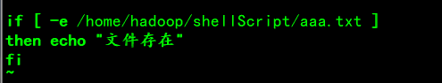

## shell编程

### Shell变量的介绍

1. Linux中的变量分为，系统变量和用户变量
2. 系统变量：$HOME、$PWD、$USER等
3. 显示当前Shell中的所有变量:set

1. 案例一：定义一个用户变量

2. 案例二：Unset 一个用户变量

   

3. 案例三：定义一个静态变量，然后unset

   

4. 案例四：把变量提升为全局环境变量，可供其他shell程序使用。

即使设置环境变量

### Shell变量的定义

#### 定义变量的规则

1. 变量名称可用字母、数字、下划线组成。但是不能一数字开头
2. 等号两侧不能有空格
3. 变量名称一般习惯为大写

#### 将命令的返回值给变量

1. 用反引号包住运行的命令，并将结果返回给变量
2. 用$()包住运行的命令，并将结果返回给变量

### 位置参数变量

#### 介绍

当我们执行一个shell 脚本时，如果希望获取到命令行的参数信息，就可以使用到位置参数变量。比如: ./myshell.sh 100 200，这个就是一个执行 shell的命令行，可以在myshell脚本中获取到参数信息.

#### 基本语法

- $n (功能描述:n为数字，$0代表命令本身，$1-$9代表第一到第九个参数，十以上的参数，十以上的参数需要用大括号包含，如S{10})

- $* (功能描述:这个变量代表命令行中所有的参数，S*把所有的参数看成一个整体)
- s@(功能描述:这个变量也代表命令行中所有的参数，不过s@把每个参数区分对待)
- S#(功能描述:这个变量代表命令行中所有参数的个数)

### 预定义变量

#### 基本介绍

就是shell设计者事先已经定义好的变量，可以直接在shell脚本中使用基本语法。

- $$：(功能描述:当前进程的进程号(PID))
- $ !：(功能描述:后台运行的最后一个进程的进程号（PID) )
- $?：(功能描述:最后一次执行的命令的返回状态。如果这个变量的值为o，证明上一个命令正
  确执行﹔如果这个变量的值为非o（具体是哪个数，由命令自己来决定)，则证明上一个命令执行不征确了。)

#### 简单使用

### 条件判断

#### 常用判断条件

两个整数的比较

1. =  字符串比较
2. -lt 小于
3. -le 小于等于
4. -eq 等于
5. -gt 大于
6. -ge 大于等于
7.  -ne 不等于

按照文件权限进行判断

1. -r 有读的权限
2. -w 有写的权限
3. -x 有执行的权限

按照文件类型进行判断

1. -f 文件存在且是一个常规的文件
2. -e 文件存在
3. -d 文件存在并是一个目录

#### 应用实例

⑴ 案例1：判断"OK"是否等于"OK"(注意写的时候要关注空格)

⑵ 案例2：判断23是否大于等于22(注意写的时候要关注空格)

⑶ 判断文件是否存在

### 流程控制

#### if 判断

基本语法的两种形式

1. if [ 条件判断 ];then
    程序
   fi

2. if [ 条件判断 ]
then 
        程序
elif [ 条件判断 ]
   then
    程序
   fi

注意事项

1. [ 条件判断 ] ，中括号和条件判断式之间必须有空格，中括号和if、elif之间也必须要有空格
2. 形式推荐使用第二种形式

应用案例：编写一个shell程序，大于等于60输出及格，小于60输出不及格

#### case判断

基本语法如下：

case $变量名 in
“值 1”）
如果变量的值等于值 1，则执行程序 1
;;
“值 2”）
如果变量的值等于值 2，则执行程序 2
;;
…省略其他分支…
*）
如果变量的值都不是以上的值，则执行此程序
;;
esac

应用实例:当命令行参数是 1 时，输出 “周一”, 是 2 时，就输出"周二"， 其它情况输出 “其他”

#### for 循环

两种形式

1. for 变 量 in 值 1 值 2 值 3…
   do
   程序
   done
   案例1:打印命令行参数（区分$*与$@的区别）

   

2. for (( 初始值;循环控制条件;变量变化 ))
   do
   程序
   done
   案例2：1到100累加并输出

   

#### white 循环

语法
while [ 条件判断式 ]
do
程序
done
案例：命令行输入一个数n，计算1+…+n的值

### read读取控制台

read(选项)(参数)
选项：

- -p：指定读取值时的提示符；
- -t：指定读取值时等待的时间（秒），如果没有在指定的时间内输入，就不再等待了

参数变量：指定读取值的变量名

案例：
1.读取控制台输入一个 num
2.读取控制台输入一个 num 值，在 10 秒内输入。

### 函数

#### 系统函数

两个系统函数

- basename（注意：basename 命令会删掉所有的前缀包括最后一个（‘/’）字符，然后将字符串显示出来，如果选项带有后缀，返回值将会把后缀删掉）
  功能：返回完整路径后面的部分，常用于获取路径名
  语法：
  basename[路径名][后缀]

  

- dirname
  功能描述：从给定的包含绝对路径的文件名中去除文件名（非目录的部分），然后返回剩下的路径（目录的部分）

#### 自定义函数

语法：
[ function ] funname[()]
{
Action;
[return int;]
}
案例：就是输入的两个数之和

### shell编程综合案例

要求

1. 每天凌晨 2:10 备份 数据库test 到 /data/backup/db
2. 备份开始和备份结束能够给出相应的提示信息
3. 备份后的文件要求以备份时间为文件名，并打包成 .tar.gz 的形式，比如：2018-03-12_230201.tar.gz
4. 在备份的同时，检查是否有 10 天前备份的数据库文件，如果有就将其删除。

分析图如下

